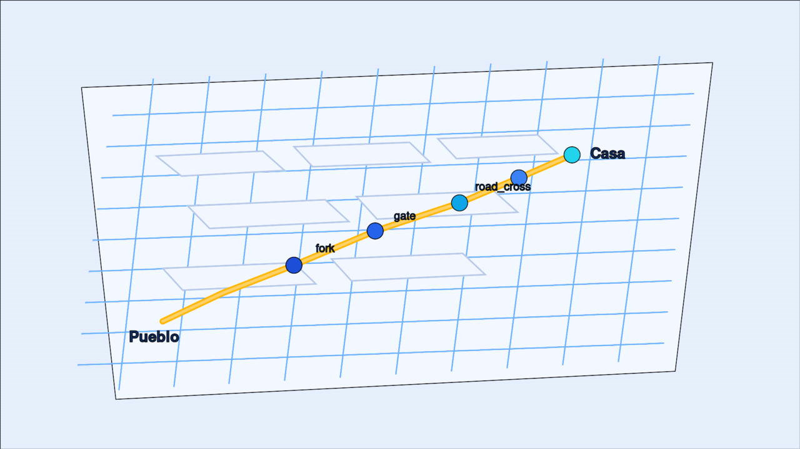
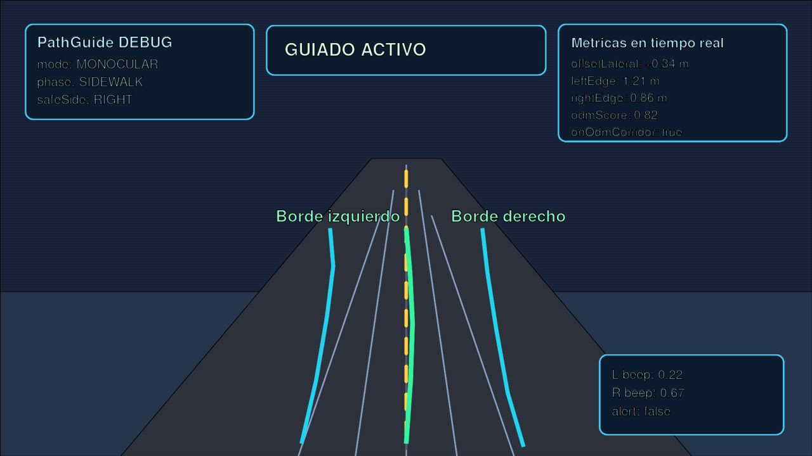

<link href="https://fonts.googleapis.com/css2?family=Outfit:wght@400;700;900&display=swap" rel="stylesheet">

<p align="center">
  
</p>

<h1 align="center" style="font-family: 'Outfit', 'Segoe UI', sans-serif; font-weight: 900; letter-spacing: 0.04em; font-size: 3.2rem; margin-bottom: 0.2em;">
  Lazaro AI
</h1>

<p align="center" style="font-family: 'Outfit', sans-serif; font-size: 1.15rem; color: #555;">
  <strong>Asistente de voz libre para Android</strong><br>
  Hecho por y para personas ciegas o con baja visión
</p>

<p align="center">
  🌍 <strong>Open Source</strong> &nbsp;·&nbsp; 🇪🇸 <strong>Español</strong> &nbsp;·&nbsp; 🏔️ <strong>Nacido en Ojén, Andalucía</strong> &nbsp;·&nbsp; 🤝 <strong>Apache 2.0</strong>
</p>

<p align="center">
  📖 <strong><a href="https://datak0w.github.io/Lazaro/">Manual de instrucciones (GitHub Pages)</a></strong>
  &nbsp;·&nbsp;
  <a href="https://datak0w.github.io/Lazaro/comandos.html">Comandos</a>
  &nbsp;·&nbsp;
  <a href="https://datak0w.github.io/Lazaro/navegacion.html">Navegación</a>
  &nbsp;·&nbsp;
  <a href="https://datak0w.github.io/Lazaro/instalacion.html">Instalación</a>
</p>

---

## 🎨 ¿Qué es Lazaro AI?

**Lazaro AI** es un compañero de voz en tu móvil Android. No necesitas ver la pantalla: hablas, escuchas y el móvil hace el resto.

Nació en la **Villa de Ojén** (Málaga, Andalucía) para cubrir las necesidades reales de un **amigo pintor**, hoy **invidente**. No es un producto de una gran empresa ni un experimento de laboratorio: es una herramienta de barrio, hecha con cariño, para que una persona pueda **moverse, comunicarse y vivir con más autonomía** sin depender de interfaces visuales.

Parte de ese trabajo pasa por **cartografiar el pueblo a pie**: hemos recorrido Ojén con una **GoPro 11** (fotos en timelapse + **GPS en cada imagen**) montada en pértiga, mirando al suelo. Esas capturas se procesan en PC con **fotogrametría 3D** (OpenDroneMap) para obtener ortofotos, modelos del terreno y un mapa mucho más fiel que el que suele existir para peatones ciegos. El objetivo no es hacer un mapa bonito: es **hacer la ciudad más accesible** — saber dónde está la acera, cuánto mide un paso, dónde sube el camino, dónde hay una verja o una bifurcación — y llevar esos datos **offline al móvil**, sin depender de internet ni de servicios de pago.

> **Lazaro AI** combina voz local (rápida y sin gastar datos) con inteligencia artificial **solo donde aporta valor**: recordar cosas, entender frases raras o buscar información. **Nunca** te guía en tiempo real por una nube: la seguridad al caminar la llevan el GPS, la cámara y el cerebro del móvil.

---

## 💚 Software libre, comunidad y autonomía

Lazaro AI es **código abierto** porque creemos en estos principios:

| Principio | Qué significa para ti |
|-----------|------------------------|
| 🆓 **Libertad** | Puedes usarlo, estudiarlo, modificarlo y compartirlo sin pedir permiso a nadie |
| 👁️ **Transparencia** | La comunidad puede auditar qué hace la app: sin cajas negras ni sorpresas |
| 🤝 **Comunidad** | Mejoramos el software entre todos: usuarios, familiares, desarrolladores, voluntarios |
| 🏠 **Autosuficiencia** | Herramientas que funcionan **en tu móvil**, no atadas a un servicio que mañana sube de precio o cierra |
| 🚫 **Desconfianza sana** | No dependemos de que una institución o empresa decida si «mereces» accesibilidad |
| 💶 **Realidad española** | Pensado para trabajadores y familias con **dificultades económicas**: sin cuotas, sin hardware caro, sin ataduras |

En un país donde muchas personas con discapacidad visual enfrentan **barreras económicas, burocráticas y tecnológicas**, el software libre no es ideología: es **supervivencia digna**.

---

## 🧠 ¿Dónde entra la IA (y dónde NO)?

Lazaro AI usa **Google Gemini** de forma **responsable y acotada**:

| ✅ La IA sí ayuda en… | ❌ La IA NO controla… |
|----------------------|----------------------|
| Entender comandos complejos o poco habituales | Los pitidos al caminar (son instantáneos, locales) |
| Recordar direcciones, contactos y preferencias | La guía por aceras y caminos grabados |
| Buscar información en internet cuando la pides | La lectura de giros de Maps (viene de notificaciones locales) |
| Proponer guardar algo que mencionas una vez | La detección de obstáculos con la cámara |
| Resumir noticias o contestar dudas generales | La decisión de llamar o navegar (siempre pide confirmación) |

**Regla de oro:** lo que importa para tu **seguridad al caminar** corre **en el teléfono**, sin esperar a un servidor.

---

## 📋 Tabla de contenidos

- **[📖 Manual completo (GitHub Pages)](https://datak0w.github.io/Lazaro/)** — instalación, comandos, navegación, configuración, mapeo…
- [Primeros pasos (sin tecnicismos)](#-primeros-pasos-sin-tecnicismos)
- [Todas las funciones](#-todas-las-funciones)
- [Comandos de voz completos](#-comandos-de-voz-completos)
- [Navegación accesible](#-navegación-accesible)
- [Guía por cámara y rutas grabadas](#-guía-por-cámara-y-rutas-grabadas)
- [Mapeo de Ojén (GoPro 11 + GPS + 3D)](#-mapeo-de-ojén-gopro-11--gps--3d)
- [Navegación con pitidos en acera](#-navegación-con-pitidos-en-acera)
- [Sitios favoritos](#-sitios-favoritos)
- [Instalación](#-instalación)
- [Permisos](#-permisos-necesarios)
- [Para desarrolladores](#-para-desarrolladores)
- [Tecnologías](#-tecnologías)
- [Bibliografía y estudios consultados](#-bibliografía-y-estudios-consultados)
- [Contribuir](#-contribuir)
- [Licencia](#-licencia)

---

## 🚀 Primeros pasos (sin tecnicismos)

1. **Instala** la app en tu Android (8 o superior).
2. Abre Lazaro AI y pulsa **Iniciar asistente**.
3. Concede permisos de **micrófono**, **ubicación** y **notificaciones** cuando te los pida.
4. Di **«Lazaro»** — oirás un tono corto que confirma que te escucha.
5. Di lo que necesitas: *«¿Dónde estoy?»*, *«Noticias»*, *«Llévame a casa»*…

💡 **Truco:** también puedes decir todo seguido: *«Lazaro, qué tiempo hace mañana»*.

### Comandos que siempre funcionan

| Dices… | Pasa esto |
|--------|-----------|
| **«Para»** / **«Detente»** | Para de hablar, navegar o procesar |
| **«Cancela»** | Cancela una confirmación pendiente |
| **«Repíteme las opciones»** | Vuelve a leer las opciones cuando hay que elegir |
| **«Sí»** / **«Vale»** | Confirma una acción (llamar, navegar, guardar…) |
| **«No»** | Rechaza y cancela |

---

## 🧰 Todas las funciones

### 🗺️ Navegación y movilidad

| Función | Qué hace |
|---------|----------|
| **Navegar a pie** | Abre Google Maps y lee cada giro en voz alta |
| **Vibración en giros** | Pulso distinto al girar a izquierda, derecha o retorno |
| **¿Dónde estoy?** | Te dice la dirección aproximada o las coordenadas |
| **Historial de ubicación** | Si te pierdes, repasa dónde has estado |
| **Transporte público** | Busca parada cercana o planifica ruta en bus/metro/tren |
| **Rutas grabadas** | Graba un camino (acera, campo, árboles) y reprodúcelo después |
| **Corredor ODM offline** | Modelo 3D del entorno (GoPro + fotogrametría); guía por snap GPS |
| **Navegación híbrida** | Maps en tramos urbanos + Lazaro en tramos que ya grabaste |
| **Sitios favoritos** | Guarda un lugar con GPS y vuelve cuando quieras |
| **Modo paseo** | Guía por cámara con pitidos, sin Maps |

### 💬 Comunicación

| Función | Qué hace |
|---------|----------|
| **Leer WhatsApp** | Lee mensajes recientes de apps de mensajería |
| **Responder WhatsApp** | Dictas la respuesta y la envía con confirmación |
| **Llamar** | Busca contactos por nombre y llama (con confirmación) |

### 📻 Información y ocio

| Función | Qué hace |
|---------|----------|
| **Noticias de España** | Lee titulares en voz alta (sin abrir YouTube) |
| **Tiempo en Ojén** | Previsión hoy, mañana u otra fecha (sin internet obligatorio) |
| **Hora actual** | Te dice qué hora es |
| **Calculadora vocal** | Operaciones como *«cuánto es 18 por 37»* |
| **Música / radio / podcast / vídeo** | Abre Spotify, YouTube, COPE y otras apps |
| **Buscar en apps** | *«Motorhead en Spotify»* abre y busca directamente |
| **Audiolibros gratis** | Gutenberg, Librivox; Libby si lo tienes instalado |
| **Buscar en internet** | Preguntas puntuales vía IA |

### 🧾 Utilidades del día a día

| Función | Qué hace |
|---------|----------|
| **Comprobar ticket** | La cámara lee un recibo y verifica que el total cuadra |
| **Memoria personal** | Guarda casa, teléfonos, preferencias |
| **Skills personalizados** | Atajos de voz: *«pon la radio»* → abre tu emisora favorita |

### 👁️ Guía espacial (cámara trasera)

| Función | Qué hace |
|---------|----------|
| **Pitidos estéreo** | Más sonido a izquierda o derecha según el espacio libre |
| **Corrección lateral en acera** | Guía proporcional para mantener la línea recta (offset lateral) |
| **Obstáculos** | Detecta coches, postes, escalones y los nombra |
| **Descripción de escena** | *«Camino despejado»*, *«Puerta a la derecha»*… |
| **Salidas y puertas** | Guía para encontrar y cruzar entradas (interior y exterior) |
| **Bifurcaciones** | Pitidos hacia la rama más abierta o la indicada por Maps |
| **Navegación exterior** | Acera, cruces peatonales, alineación en calle |
| **Profundidad (Pixel 9)** | LDAF/autofocus para distancia frontal; ARCore reservado |

---

## 🎙️ Comandos de voz completos

Di **«Lazaro»** antes (o en la misma frase). Los ejemplos son orientativos: puedes variar las palabras.

### 🗺️ Navegación

```
«Llévame a [destino]»
«Guíame a [lugar]»
«Navega a [dirección]»
«Cómo llego a [sitio]»
«Ir a casa» / «Llévame a casa»
```

Si tienes una **ruta grabada** o un **sitio guardado**, Lazaro te lo propondrá antes de abrir Maps.

### 📍 Sitios favoritos

```
«Guarda sitio [nombre]»          → Ej: «guarda sitio farmacia»
«Guarda posición [nombre]»       → Ej: «guarda posición panadería»
«Marca este lugar como [nombre]»
«Mis sitios guardados»
«Mis lugares favoritos»
«Borra sitio [nombre]»
```

### 🛤️ Rutas grabadas (Ojén y campo)

```
«Graba ruta a casa»
«Para de grabar»
«Mis rutas»
«Detalles de la ruta a casa»
«Borra la ruta a casa»
```

### 🚶 Modo paseo (sin Maps)

```
«Modo paseo» / «Iniciar paseo» / «Quiero pasear»
«Parar paseo» / «Terminar paseo»
```

### 📍 Ubicación

```
«¿Dónde estoy?»
«Dónde estoy»
«¿En qué calle estoy?»
```

### 🌤️ Tiempo (Ojén)

```
«¿Qué tiempo hace?»
«¿Qué tiempo hace mañana?»
«Tiempo en Ojén»
«¿Va a llover?»
«Previsión del tiempo»
```

### 🕐 Hora y calculadora

```
«¿Qué hora es?»
«Cuánto es [número] por [número]»
«Calcula 18 por 37»
```

### 🧾 Ticket y recibo

```
«Comprueba el ticket»
«Lee el recibo»
«Cuánto me cobran»
«Que no me engañen»
```

### 📰 Noticias

```
«Noticias»
«Titulares»
«Noticias de hoy»
«Telediario»
«¿Qué pasa en España?»
```

### 💬 Mensajes y llamadas

```
«Lee el WhatsApp» / «Lee los mensajes»
«Responde a [nombre]: [mensaje]»
«Llama a [nombre]»
```

### 🚌 Transporte público

```
«Parada de bus cercana»
«Parada de metro cercana»
«Ruta en transporte público a [destino]»
«Cómo llego en bus a [sitio]»
```

### 🎵 Música, radio y vídeo

```
«Pon música» / «Abre Spotify»
«Pon la radio» / «Pon COPE»
«Pon un podcast»
«Motorhead en Spotify»
«Busca [artista] en YouTube»
```

### 📚 Audiolibros

```
«Léeme un libro»
«Léeme el libro [título]»
«Continúa leyendo»
```

### 🧠 Memoria

```
«Recuerda que mi casa es [dirección]»
«¿Qué tienes guardado sobre casa?»
«¿Dónde he estado las últimas horas?»
```

---

## 🧭 Navegación accesible

Lazaro AI **no sustituye** Google Maps: lo **complementa** para personas ciegas.

1. Confirmas el destino por voz.
2. Se abre **Google Maps** en modo peatonal.
3. Lazaro **lee** las instrucciones de Maps en voz natural:
   - *«Ahora, gira a la derecha en Calle Mayor»*
4. En cada **giro**, el móvil **vibra** de forma distinta según el lado.

### Vibración en giros

| Maniobra | Vibración |
|----------|-----------|
| ⬅️ Izquierda | Dos pulsos cortos |
| ➡️ Derecha | Un pulso medio |
| ↩️ Retorno | Tres pulsos |

### Para que funcione bien

- ✅ Google Maps instalado y actualizado
- ✅ **Acceso a notificaciones** activado para Lazaro AI
- ✅ Volumen de medios audible

---

## 📷 Guía por cámara y rutas grabadas

### Modo paseo
La cámara trasera analiza el espacio y emite **pitidos** más fuertes hacia donde hay más sitio libre. También avisa de obstáculos con frases cortas.

### Rutas grabadas (ideal para Ojén → casa)
1. **Graba** el trayecto caminando: acera en el pueblo, camino rural, árboles…
2. Lazaro guarda el **perfil espacial** (lado seguro, giros, distancias).
3. La próxima vez que digas **«llévame a casa»**, ofrece la ruta guardada.
4. **Maps** lleva el tramo urbano; **Lazaro** retoma la guía fina donde ya pasaste antes.

> Cada nueva grabación **mejora** la ruta (como un mapa dibujado entre varios paseos).

---

## 🗺️ Mapeo de Ojén (GoPro 11 + GPS + 3D)

<p align="center">
  
</p>

### Cartografiar el pueblo a pie para hacerlo más accesible

Google Maps ayuda en la calle principal, pero **no conoce el camino real** que usa una persona ciega: la acera estrecha, el atajo entre muros, el tramo de tierra con árboles, la verja que hay que encontrar a tiento. En Ojén estamos construyendo esa capa que falta.

**Cómo lo hacemos:**

1. **Paseamos el pueblo** con GoPro 11 en timelapse, GPS activo, cámara hacia abajo (vista cenital del suelo).
2. Cada foto lleva **coordenadas GPS** en el EXIF — un rastro georreferenciado del corredor peatonal real.
3. En PC, **OpenDroneMap** reconstruye en 3D el entorno: ortofoto, nube de puntos, modelo digital del terreno (DTM).
4. En **QGIS** digitalizamos el eje del camino, la pendiente, el ancho y los puntos importantes (bifurcaciones, verjas, cruces, casa).
5. Exportamos un **bundle offline** (GeoJSON + JSON) que Lazaro carga en el móvil — **sin internet**, **sin cuota**, **sin depender de nadie**.

Así convertimos un paseo físico por Ojén en **datos 3D del entorno** que la app usa para guiar con pitidos, avisos de voz (*«subida fuerte»*, *«verja»*, *«bifurcación»*) y rutas grabadas. Es cartografía hecha **desde la perspectiva del peatón ciego**, no desde un satélite o un coche.

> 📄 **Checklist de campo (PDF):** [`docs/gopro-captura-checklist.pdf`](docs/gopro-captura-checklist.pdf) — guía paso a paso para repetir o ampliar capturas.

### Tres capas de mapa en el móvil

Lazaro combina **tres fuentes** para el trayecto **pueblo → casa** (y, a futuro, más tramos del municipio). Una vez cargadas, **no necesitan internet**:

| Capa | Origen | Qué aporta |
|------|--------|------------|
| **OSM (Overpass)** | OpenStreetMap online → caché local | Clasificar tramo urbano / campo / arbolado |
| **Rutas grabadas + heatmap** | Paseos reales con cámara + GPS | Perfil lateral aprendido, obstáculos habituales |
| **Corredor ODM** | GoPro 11 + OpenDroneMap + QGIS | Modelo 3D del entorno, eje exacto, pendiente, ancho, nodos |

### Qué aporta el modelo 3D a la accesibilidad

| Dato 3D / vectorial | Para qué sirve a la persona ciega |
|---------------------|-------------------------------------|
| **Ortofoto de alta resolución** | Ver bordes de acera, escalones y obstáculos fijos al digitalizar |
| **DTM (terreno)** | Detectar **subidas y bajadas** antes de llegar — aviso *«subida fuerte»* |
| **Eje del corredor (GeoJSON)** | Saber si vas **en el camino correcto** aunque el GPS se desvíe un poco |
| **Ancho del paso (`widthM`)** | Ajustar cuánta deriva lateral se tolera antes de avisar |
| **Nodos semánticos** | Anunciar **bifurcaciones, verjas, cruces y destino** por voz |
| **Bundle offline** | Funciona en el campo sin cobertura — crucial en tramos rurales de Ojén |

### Por qué fotogrametría terrestre a pie (no dron)

El corredor es estrecho, con vegetación y permisos municipales concretos. Un dron no ve bien debajo de los árboles ni captura el **camino exacto** que pisa una persona con bastón. Caminar con **GoPro 11 en pértiga de 2 m** (timelapse + GPS, vista nadir) registra **el mismo recorrido** que hará el usuario invidente. El procesado en **OpenDroneMap (ODM)** genera la base 3D; **QGIS** extrae el eje navegable.

### Pipeline de mapeo (PC → móvil)

```
GoPro 11 (timelapse + GPS, pértiga 2 m, nadir)
        ↓
OpenDroneMap / WebODM  (--dtm, ortofoto, nube de puntos)
        ↓
QGIS  →  digitalizar eje + perfil + nodos
        ↓
Bundle offline (3 JSON)  →  copiar al móvil
        ↓
Lazaro AI  →  snap GPS + fusión confianza + TTS en nodos
```

### Formato del bundle (`ojen_odm/`)

Copiar en el móvil a `files/maps/ojen_odm/` o incluir en assets de la app:

| Archivo | Contenido |
|---------|-----------|
| `corridor_path.geojson` | LineString del eje del corredor (WGS84) |
| `corridor_profile.json` | Puntos cada ~40–100 m: `alongM`, `bearingDeg`, `gradePct`, `widthM`, `segmentTag` |
| `corridor_nodes.json` | Nodos semánticos: `fork`, `gate`, `road_cross`, `destination` |

Ejemplo de perfil (`segmentTag`: `urban_sidewalk`, `rural_lane`, `wooded`):

```json
{"lat": 36.56520, "lng": -4.85560, "alongM": 90, "bearingDeg": 35, "gradePct": 5, "widthM": 2.2, "segmentTag": "rural_lane"}
```

Plantillas de ejemplo incluidas en `app/src/main/assets/maps/ojen_odm/` — **reemplazar tras la captura real**.

### Cómo usa Lazaro el corredor ODM

1. **Snap GPS** — `CorridorSnapEngine` proyecta la posición sobre el eje y calcula `odmScore`, distancia acumulada (`odmAlongM`) y desvío lateral.
2. **Fusión de confianza** — `CorridorFusionEngine` combina ODM + cámara + GPS + heatmap de rutas grabadas. Con ODM fuerte, el umbral de replay baja (más fácil activar guía fina).
3. **Replay enriquecido** — `RouteReplayBrain` anuncia nodos (*«Bifurcación»*, *«Verja»*, *«Subida fuerte»*) según pendiente (`gradePct`) y posición en el eje.
4. **Clasificación de tramo** — `OjenOdmBundle` prioriza `segmentTag` ODM sobre OSM al grabar nuevas rutas.

En pantalla **DEBUG** de PathGuide puedes ver: `odmScore`, `odmAlongM`, `odmGradePct`, `onOdmCorridor`.

### Comandos ODM sugeridos (PC)

```bash
docker run -ti --rm -v /ruta/proyecto:/datasets/code opendronemap/odm \
  --project-path /datasets --dtm --dem-resolution 5 --orthophoto-resolution 2
```

Iteración rápida: añadir `--fast-orthophoto` para preview; luego pasada final sin `--fast`.

---

## 🚶 Navegación con pitidos en acera

Lazaro AI guía el **centrado lateral** en la acera con pitidos estéreo. La lógica corre **en el móvil**, sin nube.

<p align="center">
  
</p>

Preview visual (estilo DEBUG): carretera en perspectiva, líneas de borde/corredor y telemetría (`offset`, `odmScore`, `safeSide`, intensidad L/R).

### Cómo interpretar los pitidos

| Señal | Significado |
|-------|-------------|
| **Silencio** | Vas bien centrado en el corredor caminable |
| **Pitido izquierdo** | Desviarte un poco a la **derecha** |
| **Pitido derecho** | Desviarte un poco a la **izquierda** |
| **Ambos lados** | Paso estrecho: sigue recto con cuidado |
| **Tono continuo de alerta** | Te acercas a la **calzada** — vuelve hacia la fachada |

### Pipeline técnico (resumen)

```
Cámara trasera (CameraX)
        ↓
WalkableCorridorEstimator   ← IPM monocular + bordes (A34)
        ↓                   ← profundidad LDAF / ARCore (Pixel 9, opcional)
LateralGuidanceController   ← error lateral → pitidos proporcionales
        ↓
OutdoorNavigationBrain      ← acera, puertas, bifurcaciones, Maps
        ↓
StereoBeepEngine            ← salida estéreo L/R
```

### Hardware recomendado

| Dispositivo | Rol | Capacidades |
|-------------|-----|-------------|
| **Samsung Galaxy A34** | Desarrollo y pruebas | Cámara + IMU (pipeline monocular) |
| **Google Pixel 9** | Cliente final | LDAF (distancia frontal puntual) + ARCore Depth (fase 2) |

> **Nota:** el LDAF del Pixel 9 da **un punto de distancia** (autofocus), no un mapa completo. Sirve para obstáculos frontales cercanos; la guía lateral usa visión monocular y, en el futuro, profundidad ARCore.

### Pantalla DEBUG

En ajustes de PathGuide puedes ver: offset lateral, bordes estimados, intensidad L/R, fuente de percepción (`monocular` / `fusionada` / `profundidad`).

---

## 📌 Sitios favoritos

Guarda puntos concretos con el GPS del momento:

1. Estás en la farmacia → *«Guarda sitio farmacia»* → **sí**
2. Otro día → *«Llévame a farmacia»* → **sí** → Maps te lleva al punto exacto

Consulta con *«mis sitios guardados»* o borra con *«borra sitio farmacia»*.

---

## 📲 Instalación

> Guía detallada: **[Manual → Instalación](https://datak0w.github.io/Lazaro/instalacion.html)**

### Usuarios (APK)

1. Descarga o compila el APK (ver sección desarrolladores).
2. Instala en el móvil (activa «orígenes desconocidos» si hace falta).
3. Abre Lazaro AI → **Iniciar asistente** → concede permisos.

### Configurar la IA (opcional pero recomendado)

Copia el archivo de ejemplo y añade tu clave gratuita de [Google AI Studio](https://aistudio.google.com/):

```bash
cp local.properties.example local.properties
```

```properties
GEMINI_API_KEY=tu_clave_aqui
GEMINI_MODEL=gemini-3.5-flash
```

> Sin clave Gemini, muchas funciones locales siguen funcionando (navegación, paseo, tiempo, noticias…). La IA mejora el diálogo libre y la memoria inteligente.

---

## 🔐 Permisos necesarios

| Permiso | Para qué |
|---------|----------|
| 🎤 **Micrófono** | Escucharte y detectar «Lazaro» |
| 📍 **Ubicación** | Navegar, guardar sitios, rutas, «¿dónde estoy?» |
| 🔔 **Notificaciones** | Servicio estable + leer giros de Maps |
| 📱 **Acceso a notificaciones** | WhatsApp y **instrucciones de Google Maps** |
| 📒 **Contactos / teléfono** | Llamadas por nombre |
| 📳 **Vibración** | Giros en navegación |
| 📷 **Cámara** | Paseo, rutas grabadas, tickets |
| ♿ **Accesibilidad** (opcional) | Confirmar envío en WhatsApp |

---

## 🛠️ Para desarrolladores

### Requisitos

- Android SDK, API 26+
- JDK 17
- Clave Gemini en `local.properties` (no subir a Git)

### Compilar

```bash
git clone https://github.com/datak0w/Lazaro.git
cd Lazaro
./gradlew assembleDebug
adb install -r app/build/outputs/apk/debug/app-debug.apk
```

### Tests

```bash
./gradlew testDebugUnitTest
```

### Arquitectura (resumen)

```
AssistantForegroundService
        ↓
AssistantController  ←→  Speech / TTS / Wake word (Vosk)
        ↓
GeminiOrchestrator → ActionExecutor
        ↓                    ↓
   Memoria / IA      Navegación, media, rutas…
                           ↓
              NavigationGuidanceMonitor ← Maps
              PathGuideController ← Cámara + pitidos
```

**Stack:** Kotlin · Jetpack Compose · Hilt · Room · Gemini · Vosk · ML Kit · CameraX · ARCore · OpenStreetMap · GeoJSON

### Módulos PathGuide (navegación espacial)

| Módulo | Función |
|--------|---------|
| `WalkableCorridorEstimator` | Estima centro y bordes del corredor caminable (IPM + bordes) |
| `LateralGuidanceController` | Convierte offset lateral en pitidos proporcionales L/R |
| `OutdoorNavigationBrain` | Orquesta acera, puertas, bifurcaciones y Maps |
| `SidewalkNotificationSystem` | Alertas de calzada y recuperación |
| `JunctionBeepGuide` | Pitidos en bifurcaciones (T) |
| `DoorwayGuideProtocol` | Alineación para cruzar puertas |
| `DepthPerceptionProvider` | LDAF (Pixel 9) + ARCore Depth (fase 2) |
| `FocusDistanceProbe` | Distancia focal vía Camera2Interop |
| `StereoBeepEngine` | Sonificación estéreo continua |
| `DepthHardwareDetector` | Elige backend según dispositivo (A34 / Pixel 9) |
| `ArcorePathGuideCamera` | Cámara + profundidad cuando ARCore posee el sensor |

### Módulos de mapeo y rutas

| Módulo | Función |
|--------|---------|
| `OjenMapBundle` | Descarga/caché OSM Overpass (footways, paths) en bbox Ojén |
| `OjenOdmBundle` | Carga bundle GeoJSON + perfil + nodos del corredor ODM |
| `CorridorSnapEngine` | Proyección GPS sobre eje; score lateral y `alongM` |
| `CorridorFusionEngine` | Confianza híbrida ODM + corridor + GPS + heatmap |
| `RouteMapMatcher` | Matching polilínea + snap ODM + fusión en replay |
| `RouteReplayBrain` | Pitidos + TTS de nodos ODM y pendiente |
| `RouteHeatmapBuilder` | Mapa de calor lateral aprendido de paseos |
| `HybridNavigationCoordinator` | Conmuta Maps ↔ replay según tramo |

### Estructura del código

```
app/src/main/java/io/lazaro/
├── assistant/     # Flujo de voz
├── voice/         # STT, TTS, wake word
├── navigation/    # Maps + vibración
├── pathguide/     # Cámara, pitidos, paseo, profundidad
├── routes/        # Rutas grabadas + replay híbrido + map/
│   └── map/       # OjenMapBundle, OjenOdmBundle, snap, fusión
├── actions/       # Ejecutor de comandos
├── ai/            # Gemini y herramientas
├── memory/        # Memoria, sitios, skills
├── news/          # Titulares España
├── media/         # Spotify, YouTube…
├── transit/       # Transporte público
├── audiobook/     # Libros gratis
├── tools/         # Tiempo, calculadora, clima
└── receipt/       # Lectura de tickets
```

---

## 🔧 Tecnologías

Lazaro AI integra software libre, APIs abiertas y sensores del móvil. Todo lo crítico para caminar corre **on-device**.

### Plataforma y UI

| Tecnología | Uso |
|------------|-----|
| **Kotlin** | Lenguaje principal |
| **Jetpack Compose** | Interfaz accesible |
| **Hilt** | Inyección de dependencias |
| **Room** | Rutas, observaciones, heatmaps |
| **DataStore** | Preferencias |
| **Coroutines** | Cámara, GPS, red async |

### Voz e IA

| Tecnología | Uso |
|------------|-----|
| **Vosk** | Wake word «Lazaro» y STT offline |
| **Android TTS** | Síntesis de voz en español |
| **Google Gemini** | Diálogo, memoria, búsqueda (opcional, acotado) |

### Percepción espacial (cámara)

| Tecnología | Uso |
|------------|-----|
| **CameraX** | Preview + análisis de frames (A34, Pixel LDAF) |
| **Camera2Interop** | Metadatos autofocus / LDAF (`LENS_FOCUS_DISTANCE`) |
| **ARCore Depth API** | Mapa de profundidad en Pixel 9 (modo `ARCORE_DEPTH`) |
| **ML Kit** | Etiquetado de escena y OCR (tickets) |
| **IPM monocular** | Vista cenital del corredor caminable (sin LiDAR) |

Modos de profundidad (`DepthGuidanceMode`):

| Modo | Dispositivo | Backend cámara |
|------|-------------|----------------|
| `MONOCULAR` | Samsung A34 | CameraX + heurísticas RGB |
| `LDAF_ONLY` | Pixel sin sesión ARCore | CameraX + distancia focal puntual |
| `ARCORE_DEPTH` | Pixel 9 | ARCore posee cámara + depth map |

> ARCore **no comparte** cámara con CameraX cuando se usa Depth API; por eso en Pixel 9 el backend ARCore abre el sensor directamente.

### Mapeo, GPS y rutas

| Tecnología | Uso |
|------------|-----|
| **Fused Location Provider** | GPS alta precisión para snap y grabación |
| **OpenStreetMap + Overpass API** | Footways y paths en bbox Ojén (`OjenMapBundle`) |
| **GeoJSON** | Eje del corredor ODM (`corridor_path.geojson`) |
| **OpenDroneMap (ODM)** | Fotogrametría GoPro → ortofoto, DTM, nube de puntos |
| **QGIS** | Digitalización del eje, perfil de pendiente y nodos |
| **Haversine + proyección segmento** | Snap GPS sobre polilínea (`CorridorSnapEngine`) |

### Navegación externa

| Tecnología | Uso |
|------------|-----|
| **Google Maps** | Tramos urbanos; instrucciones vía notificaciones |
| **NotificationListener** | Leer giros de Maps en voz natural |
| **Google Directions / Transit** | Transporte público (cuando se solicita) |

### Captura de campo (cartografía de Ojén)

| Equipo / software | Rol |
|-------------------|-----|
| **GoPro 11** | Timelapse foto + GPS embebido en cada imagen |
| **Pértiga 2 m** | Altura constante, vista nadir del suelo peatonal |
| **OpenDroneMap / WebODM** | Reconstrucción 3D: ortofoto, nube de puntos, DTM |
| **QGIS** | Digitalizar eje, pendiente, nodos de accesibilidad |
| **Checklist PDF** | [`docs/gopro-captura-checklist.pdf`](docs/gopro-captura-checklist.pdf) |

El objetivo a largo plazo: **mapear progresivamente Ojén** — calles, plazas, senderos — y convertir cada captura en capas offline que mejoren la autonomía de personas ciegas en el municipio.

---

## 📚 Bibliografía y estudios consultados

Investigación y referencias que han guiado el diseño de la **navegación con pitidos**, la **guía por acera** y el **mapeo del corredor** en Lazaro AI:

### Seguimiento de corredor y acera

| Referencia | Enlace | Aplicación en Lazaro |
|------------|--------|----------------------|
| **Corridor-Walker** — path following con audio espacial (MobileHCI 2022) | [PDF](https://www.masakikuribayashi.com/data/project/masaki_kuribayashi_mobilehci_2022/paper.pdf) | Wall-following virtual: mantener distancia al borde del corredor |
| **StreetNav** — anti-veering en exterior (arXiv 2023) | [doi:10.48550/arxiv.2310.00491](https://doi.org/10.48550/arxiv.2310.00491) | Reducir deriva lateral al caminar en acera |
| **EA-IPM** — vista cenital para aceras con pitch/roll | [KoreaScience](https://koreascience.kr/article/JAKO202315343225622.page) | Proyección IPM de la ROI inferior para medir offset lateral |
| **PathFinder** — free path en profundidad monocular (arXiv 2025) | [arXiv:2504.20976](https://arxiv.org/html/2504.20976) | Corredor transitable y evitación frontal |
| **Visual path following for blind pedestrians** (survey) | [ScienceDirect](https://www.sciencedirect.com/science/article/pii/S0952197620301234) | Marco general path following + audio |

### Fotogrametría, DTM y mapeo offline

| Referencia | Enlace | Aplicación en Lazaro |
|------------|--------|----------------------|
| **OpenDroneMap** — pipeline fotogramétrico open source | [opendronemap.org](https://www.opendronemap.org/) | Procesar GoPro → ortofoto + DTM del corredor |
| **WebODM** — interfaz web para ODM | [WebODM docs](https://docs.webodm.org/) | Procesado en PC sin licencias propietarias |
| **Structure from Motion (SfM) overview** (MDPI Remote Sensing) | [doi:10.3390/rs13050884](https://doi.org/10.3390/rs13050884) | Base teórica de la reconstrucción 3D desde fotos |
| **UAV/terrestrial photogrammetry for trail mapping** | [ISPRS Annals](https://www.isprs-ann-photogramm-remote-sens-spatial-inf-sci.net/) | Captura a baja altura sobre senderos estrechos |
| **GeoJSON specification (RFC 7946)** | [RFC 7946](https://datatracker.ietf.org/doc/html/rfc7946) | Formato del eje `corridor_path.geojson` |
| **QGIS** — SIG libre para digitalización | [qgis.org](https://qgis.org/) | Trazar eje, exportar perfil y nodos |

### OpenStreetMap y clasificación de tramos

| Referencia | Enlace | Aplicación en Lazaro |
|------------|--------|----------------------|
| **Overpass API** | [wiki.openstreetmap.org](https://wiki.openstreetmap.org/wiki/Overpass_API) | Descarga footways/paths en bbox Ojén |
| **OSM highway=footway / path / track** | [Map features](https://wiki.openstreetmap.org/wiki/Map_features) | Tags para `OjenMapBundle` (urbano vs rural) |
| **Map matching algorithms survey** | [ACM Computing Surveys](https://doi.org/10.1145/3460340) | Snap GPS sobre polilínea (CorridorSnapEngine) |

### GPS, snap-to-path y fusión de sensores

| Referencia | Enlace | Aplicación en Lazaro |
|------------|--------|----------------------|
| **Hidden Markov map matching** (Newson & Krumm) | [Microsoft Research](https://www.microsoft.com/en-us/research/publication/map-matching-for-low-sampling-rate-gps-trajectories/) | Inspiración para matching sobre ruta grabada |
| **Kalman filtering for GPS + IMU fusion** | [IEEE](https://ieeexplore.ieee.org/document/4650226) | Suavizado de posición en replay |
| **Pedestrian dead reckoning** (PDR) survey | [Sensors (MDPI)](https://doi.org/10.3390/s20174802) | Complemento futuro entre fixes GPS |

### Sonificación y accesibilidad

| Referencia | Enlace | Aplicación en Lazaro |
|------------|--------|----------------------|
| **WatchOut** — mapeos azimut→pan, distancia→pitch (ACM TAC 2021) | [doi:10.1145/3441852.3471203](https://doi.org/10.1145/3441852.3471203) | Pitidos estéreo L/R + frecuencia según proximidad frontal |
| **Kalimeri et al.** — sonificación de obstáculos para peatones ciegos | [ACM TAC 2021](https://doi.org/10.1145/3441852.3471203) | Zona segura = silencio; deadband estrecho en recta |
| **Soundscape navigation for blind users** (Frontiers) | [Frontiers in Psychology](https://www.frontiersin.org/journals/psychology) | Diseño de cues no verbales en exterior |
| **vOICe / The vOICe learning effect** | [PLoS ONE](https://journals.plos.org/plosone/) | Referencia histórica de visión sonificada (contraste con pitidos proporcionales) |

### Puertas, pasillos y bifurcaciones

| Referencia | Enlace | Aplicación en Lazaro |
|------------|--------|----------------------|
| **Detección de puertas con visión monocular indoor** (IEEE 2021) | [doi:10.1109/ieeeconf49454.2021.9382783](https://doi.org/10.1109/ieeeconf49454.2021.9382783) | Vanishing point + jambas verticales |
| **Hipótesis geométrica de marcos de puerta** (Unizar, arXiv 2024) | [arXiv:2401.17056](https://arxiv.org/abs/2401.17056) | Fase 2: puertas con profundidad |

### Profundidad en móvil (Pixel 9 / ARCore)

| Referencia | Enlace | Aplicación en Lazaro |
|------------|--------|----------------------|
| **ARCore Raw Depth API** (Google) | [Documentación](https://developers.google.com/ar/develop/java/depth/raw-depth) | Mapa de profundidad en Pixel 9 (fase 2) |
| **CameraX + Camera2Interop** — metadatos de autofocus | [Stack Overflow / CameraX](https://stackoverflow.com/questions/74641691/android-camerax-how-to-get-af-status-associated-with-an-analysis-imageproxy) | LDAF: `LENS_FOCUS_DISTANCE` vía capture callback |
| **Dual-pixel / LDAF depth from single camera** | [Google Research](https://research.google/) | Distancia frontal puntual en Pixel 9 |

### Aprendizaje de rutas y heatmaps

| Referencia | Enlace | Aplicación en Lazaro |
|------------|--------|----------------------|
| **Route learning from repeated trajectories** | [GIScience](https://doi.org/10.1145/3460340) | Heatmap lateral de paseos (`RouteHeatmapBuilder`) |
| **Crowdsourced pedestrian path data** | [Transportation Research](https://www.sciencedirect.com/journal/transportation-research-part-c-emerging-technologies) | Fusión de varios recorridos en un perfil canónico |

### Control y robótica peatonal (conceptos)

- **Pure pursuit / Stanley controller** — convertir error lateral en intensidad de pitido proporcional (no binaria).
- **Segmentación walkable** — acera vs calzada (heurística depth + umbral; ML ONNX opcional en fase 5).
- **Snap-to-corridor + confidence fusion** — combinar ODM, visión y GPS antes de activar replay (evita falsos positivos en campo).

> Si conoces más estudios sobre navegación peatón para personas ciegas, fotogrametría terrestre o map matching GPS, [abre un issue](https://github.com/datak0w/Lazaro/issues) o envía un PR ampliando esta sección.

---

## 🤝 Contribuir

¡Las contribuciones son bienvenidas! Especialmente:

- 🧑‍🦯 Pruebas con usuarios ciegos o con baja visión
- 🇪🇸 Variantes del español (Andalucía, Latinoamérica…)
- 🗺️ Navegación, transporte, **mapeo 3D de Ojén** y mapas offline
- 📷 Capturas con GoPro en calles y senderos del municipio
- 📖 Documentación y traducciones
- 🐛 Corrección de errores

### Cómo colaborar

1. Haz **fork** del repositorio
2. Crea una rama: `git checkout -b mejora/mi-aporte`
3. Haz tus cambios y prueba en un móvil real si puedes
4. Abre un **Pull Request** explicando qué mejora y cómo probarla

> ⚠️ No subas claves API ni `local.properties`.

---

## 📜 Licencia

**Apache License 2.0** — software libre.

- ✅ Usar, modificar y distribuir libremente
- ✅ Uso personal y comercial
- 📋 Mantener aviso de copyright y licencia en copias

Texto legal completo: [LICENSE](LICENSE)

---

## ✉️ Autor y contacto

**Copyright © 2026 [datak0w](https://github.com/datak0w)**

- 🐙 Repositorio: [github.com/datak0w/Lazaro](https://github.com/datak0w/Lazaro)
- 🐛 Incidencias: [GitHub Issues](https://github.com/datak0w/Lazaro/issues)

---

<p align="center" style="font-family: 'Outfit', sans-serif;">
  <strong>Lazaro AI</strong> — porque no hace falta ver para ir lejos.<br>
  <em>De Ojén para el mundo. Software libre para quien más lo necesita.</em>
</p>

<p align="center">
  ⭐ Si te ayuda, dale una estrella al repo y cuéntaselo a alguien que pueda necesitarlo.
</p>
